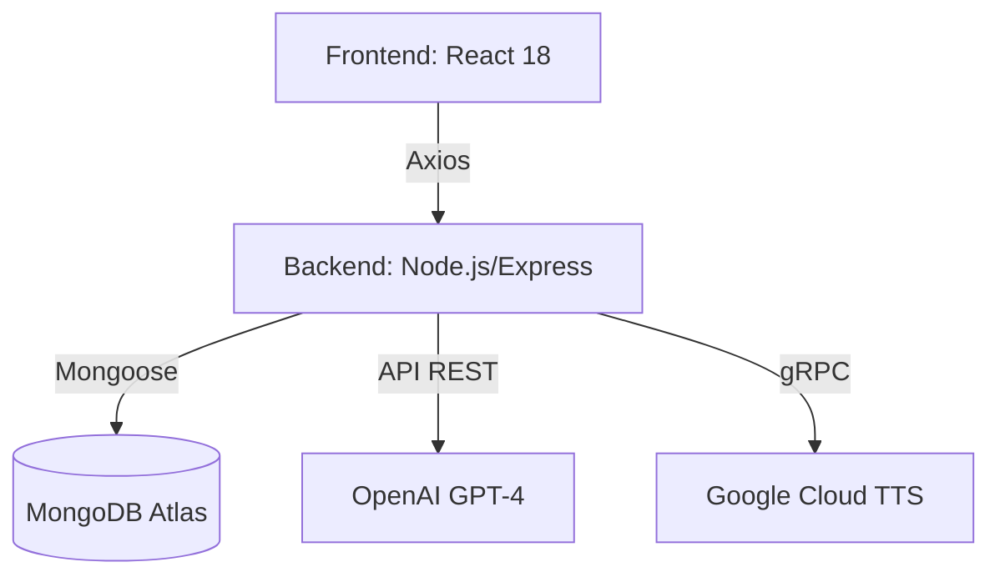

# Actividad_2
## BARRETO_SAMANIEGO_ACTIVIDAD_2

# TheraVoice - Plataforma Terapéutica Asistida por IA


---

## Descripción del Proyecto
**TheraVoice** es una plataforma web responsive diseñada para apoyar el desarrollo del habla en niños con síndrome de Down. Emplea inteligencia artificial generativa (GPT-4 de OpenAI) para generar dinámicamente ejercicios de articulación y lenguaje, con retroalimentación auditiva proporcionada mediante Google Cloud Text-to-Speech.

Esta solución permite a terapeutas y padres generar cuentos, frases y actividades fonológicas personalizadas, almacenando los avances en una base de datos MongoDB. El sistema está construido con Node.js (Express) en el backend y React.js en el frontend.

---

## Tabla de Contenidos
1. [Arquitectura del Sistema](#-arquitectura-del-sistema)
2. [Tecnologías Utilizadas](#-tecnologías-utilizadas)
3. [Prerrequisitos](#-prerrequisitos)
4. [Configuración del Entorno](#-configuración-del-entorno)
5. [Instalación](#-instalación)
6. [Despliegue](#-despliegue)
7. [API Reference](#-api-reference)
8. [Testing](#-testing)
9. [Licencia](#-licencia)

---

## Arquitectura del Sistema


- **Frontend (React)**: interfaz accesible, adaptativa y amigable.
- **Backend (Node.js + Express)**: contiene endpoints RESTful para autenticación, usuarios, historial de actividades y generación de ejercicios.
- **Base de Datos (MongoDB)**: almacena usuarios, ejercicios generados, y progreso del niño.
- **OpenAI API**: se utiliza para generar historias, juegos de palabras y ejercicios fonéticos.
- **Google TTS**: convierte texto a voz para retroalimentación auditiva en tiempo real.

---

## Tecnologías Utilizadas
| Herramienta          | Descripción |
|----------------------|-------------|
| Node.js              | Entorno de ejecución para JavaScript en el backend |
| Express.js           | Framework web para construir APIs REST |
| React.js             | Biblioteca JavaScript para construir interfaces de usuario |
| MongoDB Atlas        | Base de datos NoSQL para almacenar usuarios y ejercicios |
| Mongoose             | ODM para modelar objetos y esquemas en MongoDB |
| OpenAI API           | IA generativa para generar contenido terapéutico personalizado |
| Google Text-to-Speech| Servicio de texto a voz para retroalimentación auditiva |
| Insomnia             | Cliente de pruebas para endpoints API REST |
| Visual Studio Code   | Entorno de desarrollo integrado |
| TailwindCSS          | Framework CSS para estilos responsivos |

---

## Prerrequisitos
Antes de comenzar, nos aseguramos de tener instalado:
- Node.js v18+
- npm o yarn
- Cuenta en OpenAI y Google Cloud con claves API válidas
- MongoDB Atlas (opcionalmente puedes usar una instancia local)
- Git (opcional)

---

## Configuración del Entorno
1. Clonamos el repositorio:
```bash
git clone https://github.com/tu-usuario/theravoice-app.git
cd theravoice-app
```

2. Creamos un archivo `.env` y configuramos las variables de entorno:
```env
PORT=3000
MONGODB_URI=mongodb+srv://<usuario>:<contraseña>@cluster.mongodb.net/theravoice
OPENAI_API_KEY=sk-xxxxxxx
GOOGLE_TTS_KEY=path/to/google-credentials.json
```

3. Instalamos las dependencias del backend:
```bash
npm install
```

4. Iniciamos el servidor:
```bash
npm run dev
```

---

## Instalación del Frontend 
```bash
cd frontend
npm install
npm run dev
```

---

## Despliegue
Para desplegar el backend en una plataforma como **Render**, **Railway** o **Heroku**, realizamos lo siguiente:

1. Subimos el repositorio a GitHub.
2. En la plataforma seleccionada, conectamos nuestro repositorio.
3. Configuramos las variables de entorno desde la interfaz web.
4. Seleccionamos el comando de inicio:
```bash
npm run dev
```
5. Nos aseguramos de permitir tráfico desde los puertos adecuados y que nuestro frontend apunte a esa URL de producción.

---

## API Reference
### Endpoint: `POST /api/ejercicio`
**Descripción:** Genera un ejercicio personalizado de lenguaje.
**Body:**
```json
{
  "prompt": "Genera una historia con palabras que contengan sílabas directas para un niño de 6 años"
}
```
**Respuesta:**
```json
{
  "ejercicio": "Había una niña que jugaba con su gato en la casa..."
}
```

### Endpoint: `GET /api/progreso/:id`
**Descripción:** Devuelve el historial de progreso del niño.

---

## Testing
- Para probar los endpoints podemos usar [Insomnia](https://insomnia.rest/) o [Postman](https://www.postman.com/).
- Ejecutamos pruebas locales en desarrollo:
```bash
npm test
```

---

## Créditos Académicos
**Universidad de las Fuerzas Armadas ESPE**  
Asignatura: Arquitectura de Software  
Docente: Geovanny Cudco  
Actividad: Integración de APIs externas  
Autor: Barreto Alexander y Samaniego Veronica  
Fecha de entrega: 23 de julio de 2025

